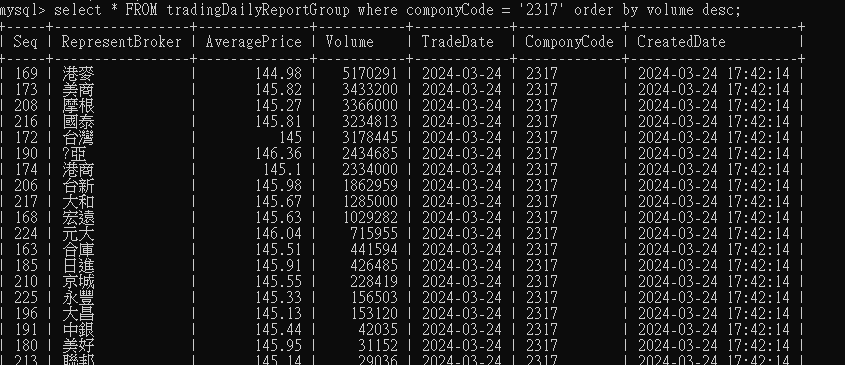

# Table Schema 設計說明

**說明**

“1021合庫台中”， 一天對於一支股票可能交易多筆，例如

| 1020合庫 | +2張 | -1張 | 100元 |
| --- | --- | --- | --- |
|  | +1張 | -1張 | 95元 |
|  | +3張 | -2張 | 105元 |

“1020合庫”、”1021合庫台中”、“1022合庫台南” … 皆屬於 “合庫”

該交易的股票資訊(成交筆數、成交股數、開收盤價…) → **TradingDailyReportHeader**

‘1021合庫台中” 每一筆交易 → **TradingDailyReportDetail**

‘1021合庫台中” 總結買賣超與均價 → **TradingDailyReportBroker**

“合庫”(包含所有子公司) 總買賣超與均價 →  **TradingDailyReportGroup**

紀錄上述每個操作是否都有正常執行完成 -> **TradingDailyReportMonitor**

---

**主要查找方式**

1.透過股票代號找出 券商Group 在這個均價是做多還是做空

```sql
select * FROM tradingDailyReportGroup
where componyCode = '2317' order by volume desc;
```



2.找出這個 券商Group 的子公司是做多還是做空

```sql
select * FROM tradingDailyReportBroker
where componyCode = '2317' and broker like '%玉山%' order by tradeVolume desc;
```


3.找出這個子公司當日每筆交易

```sql
select * FROM tradingDailyReportDetail
where componyCode = '2317' and broker like '%玉山台中' order by UnitPrice desc;
```


查Group中所有券商名稱

```sql
select Broker FROM tradingDailyReportbroker group by Broker;
```

---

**TradingDailyReportDetail (當日交易 表身)**


| Broker | 券商 |
| --- | --- |
| UnitPrice | 價格 |
| BuyVolumn | 買進股數 |
| SellVolumn | 賣出股數 |
| TradeDate | 交易日期 |
| ComponeyCode | 股票代號 |

---

**TradingDailyreportHeader (當日交易 表頭)**


| TradeDate | 交易日期 |
| --- | --- |
| ComponyCode        | 股票代號 |
| TransactionCount   | 成交筆數 |
| TransactionAmount  | 成交金額 |
| TransactionVolume  | 成交股數 |
| OpeningPrice       | 開盤價 |
| HighestPrice       | 最高價 |
| LowestPrice        | 最低價 |
| ClosingPrice       | 收盤價 |

---

**TradingDailyReportMonitor (確認每隻股票是否都執行成功)**


| TradeDate | 交易日期 |
| --- | --- |
| ComponyCode | 股票代號 |
| Result | 處理結果 |
| Log | 錯誤訊息 |

---

**TradingDailyReportBroker (當日交易資料，By券商)**


| TradeDate | 交易日期 |
| --- | --- |
| ComponyCode | 股票代號 |
| Broker | 券商 |
| TradeVolume | 買賣數 |
| AveragePrice | 均價 |

---

**TradingDailyReportGroup (將券商分行 Group 起來，藉此知道這個單位主要的方向)**


| RepresentBroker | 代表券商(1020合庫 , 1021合庫台中 , 1022合庫台南 -> 合庫)
| AveragePrice | 均價 |
| Volume | 總交易數(單位/股) |
| TradeDate | 交易日期 |
| ComponyCode | 股票代號 |

---

### **常用 SQL**

**1.取得近30天總共有幾天交易日**

```sql
SELECT COUNT(DISTINCT DATE(createddate)) AS 近30天總交易日
FROM tradingdailyreportmonitor
WHERE createddate > DATE_SUB(CURDATE(), INTERVAL 30 DAY);
```

**2.取得近幾天同券商做多天數排行**

```sql
SELECT Broker as 券商分行,COUNT(DISTINCT tradedate) as 近30天做多次數
FROM tradingdailyreportbroker
WHERE (
    (createddate >=
    (SELECT DATE_FORMAT(DATE_SUB(CURDATE() , INTERVAL 30 DAY), '%Y-%m-%d'))
    AND componycode = '2317' --要記得改
    AND TradeVolume > 0)
)
GROUP BY Broker
ORDER BY COUNT(DISTINCT tradedate) DESC;
```

**3.查特別突出的券商資料**

```sql
SELECT * FROM tradingdailyreportbroker
WHERE
    createddate >=
    (SELECT DATE_FORMAT(DATE_SUB(CURDATE(), INTERVAL 30 DAY), '%Y-%m-%d'))
    AND componyCode = '2317' --要記得改
    and broker = '9231凱基員林'; --要記得改
```

**4.今天收漲 5% 以上的股票**

```sql
 select * from tradingdailyreportheader where  ABS
 ((ClosingPrice-OpeningPrice)/OpeningPrice)*100 > 5
and createddate = CURDATE();
```

**總結 (近30天的所有交易日，券商做多比例)**

```sql
SET @componyCode = 2317; --查詢目標公司
SET @targetDate = CURDATE(); --預設當天 或是 '2024-05-30'格式可任意調整
SET @daysSinceTargetDate = 30; --從預設日往前30天開始算


SELECT
 @componyCode as 股票代號,
 Broker as 券商分行,
 (SELECT COUNT(DISTINCT DATE(createddate)) FROM tradingdailyreportmonitor WHERE
 createddate > DATE_SUB(@targetDate, INTERVAL @daysSinceTargetDate DAY))
 AS 區間內可交易天數,
 COUNT(DISTINCT tradedate) as 總交易天數 ,
 SUM(TradeVolume)/1000 AS 買進張數,
 COUNT(DISTINCT CASE WHEN TradeVolume > 0 THEN tradedate END ) AS 做多天數,
 CONCAT(
        FORMAT(
            (COUNT(DISTINCT CASE WHEN TradeVolume > 0
            THEN tradedate END) / COUNT(DISTINCT tradedate)) * 100
            ,2),'%'
        ) AS 做多比例,
  (
   CONCAT(
        FORMAT(
            (
                COUNT(DISTINCT tradedate) /
                (SELECT COUNT(DISTINCT DATE(createddate))
                FROM tradingdailyreportmonitor WHERE
                 createddate > DATE_SUB(@targetDate,
                 INTERVAL @daysSinceTargetDate DAY))
            ) * 100, 2
        ),
        '%'
    )
  ) as 交易頻率

FROM tradingdailyreportbroker
WHERE (
    (createddate >=
    (SELECT DATE_FORMAT(DATE_SUB(@targetDate , INTERVAL
    @daysSinceTargetDate DAY), '%Y-%m-%d'))
    AND componycode = @componyCode)
)
GROUP BY Broker
ORDER BY

    SUM(TradeVolume) desc,
    (
                COUNT(DISTINCT tradedate) /
                (SELECT COUNT(DISTINCT DATE(createddate)) FROM
                 tradingdailyreportmonitor WHERE createddate > DATE_SUB
                 (@targetDate, INTERVAL @daysSinceTargetDate DAY))
            )  DESC,

            (
            COUNT(DISTINCT CASE WHEN TradeVolume > 0 THEN tradedate END)
            /
            COUNT(DISTINCT tradedate)
            ) desc;

-- 交易頻率比例 是 數字+百分比 ex.85.71%
-- 倒數第二個 ORDER BY是 交易頻率 數字型態 (方便排序)
-- 最後一個是 做多比例
```


---
