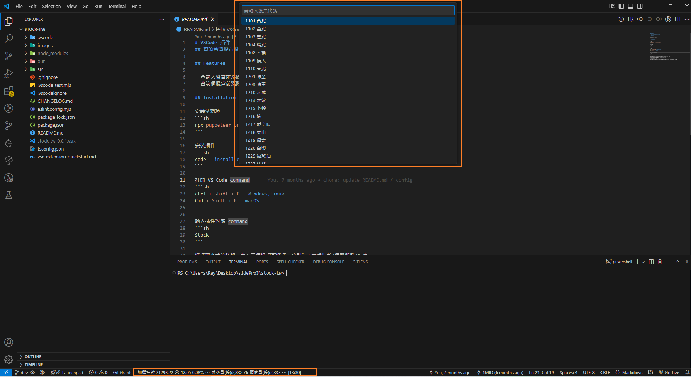

# VSCode 插件
## 查詢台灣股市股票漲跌幅資訊



## Features

- 查詢大盤當前漲跌幅
- 查詢個股當前漲跌幅

## Installation

安裝依賴項
```sh
npx puppeteer browsers install
```

安裝插件
```sh
code --install-extension <stock-tw>.vsix
```

打開 VS Code command
```sh
ctrl + shift + P --Windows,Linux
Cmd + Shift + P --macOS
```

輸入插件對應 command
```sh
Stock
```


選擇要查看的資訊，共有三個選項可選擇，分別為：大盤指數/個股漲跌/結束

* 大盤指數：會輪播加權指數、櫃買指數、各類股漲跌資訊...等
* 個股漲跌：輸入股票代號後持續追蹤當前漲跌資訊
* 結束：選擇後停止查詢資料

選擇完成後點擊 Enter，程式會自動取得對應股票資訊顯示於 VSCode 左下角狀態列中
