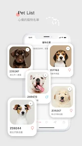
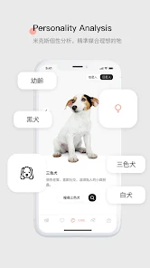
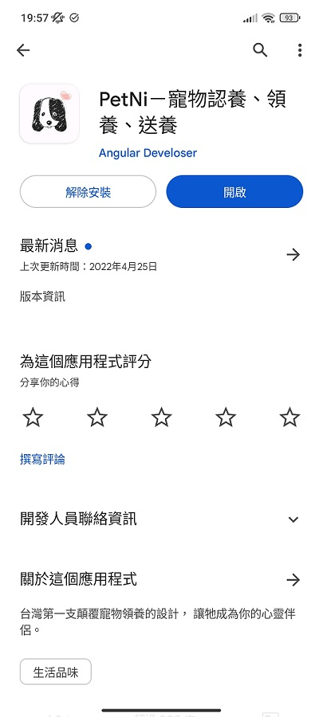
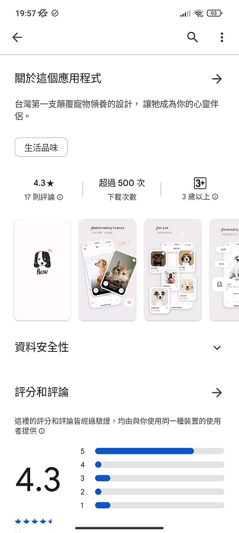
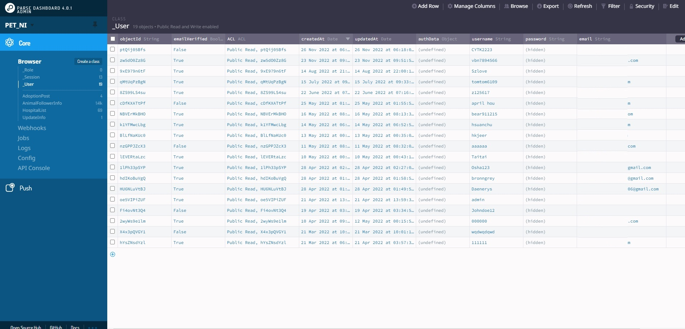

# 視覺圖

# 商城

# 領養APP專案介紹與技術細節

## 介紹
- 專案背景與目的：促進寵物領養的平台，解決了傳統領養流程繁瑣、資訊不透明的問題

- 使用技術：包括 Angular、AWS 雲佈署、SSL、Parse Server、RxJS、Ionic ...等

- 成果與影響：獲得了 800 次下載，評分 4.3。

## Demo版本 (純前端版本)
- 僅為手機使用，故建議視窗尺寸：375 x 720
- DEMO網址：https://graceful-crisp-3342b8.netlify.app/
- (update: 後續因維運資金考量，暫由 APP Store下架。目前可先從Demo網址調整視窗大小，以手機尺寸訪問內容)

## 技術點

### **前端**

- **1. Angular**
  - 熟悉資料傳輸與應用。
  - Component-Module拆分：將可共用的部分做成Module，避免冗餘代碼。
  - Nesting Route配置。

- **2. RxJS**
  - 用於首頁滑動效果及訂閱操作。

- **3. 三方庫的使用**
  - **Ionic**：提供Tabs、Back-btn、IndexedDB操作API。
  - **ngx-lottie**：讀取JSON動畫，替代幀圖動畫，節省客戶端空間與內存。
  - **Skeleton**：實現骨架屏效果。
  - **Parse Server**：管理MongoDB數據。

### **後端**

- **1. AWS S3託管靜態網頁**
  - 解決SPA頁面路由刷新導致的錯誤問題。

- **2. CloudFront應用**
  - 配合Route53託管網址，透過ACM生成SSL憑證以啟用HTTPS。
  - 處理CloudFront快取機制導致的資料更新延遲問題。

- **3. 郵件代發功能**
  - 從Mailgun轉為SendGrid，依據文檔逐步實現。

- **4. 自架Parse Server**
  - 使用Heroku進行部署，通過Dashboard查看Log排錯。
  

---

## 優化部分

### **載入速度**

1. 使用Lazy-loading降低首次載入速度，提升使用者體驗。
2. 採用AOT編譯減小檔案體積。

### **降低網路傳輸**

1. 短時間內不重複Query相同API資料，將資料儲存在IndexedDB並設定更新時間。
2. 將Query分批處理，例如：
   - 第一次撈取 0 - 300筆資料，若少於30筆則自動補充下一批資料（301 - 600筆），以此類推。

### **降低後端負荷**

1. 壓縮使用者上傳圖片（透過Canvas重繪）以減少後端存儲與上傳時間。
2. 本地快取歷史數據，例如查看歷史發文時優先使用快取資料，避免頻繁向後端請求。

---

## 困難點

### **AWS學習與配置**
- 購買網域並透過Route53託管。
- 配置EC2上的SSL證書以啟用HTTPS。
- 處理Linux配置問題（如CORS）。

### **Native開發挑戰**
1. WebView下照片上傳功能失效，需要Native攔截事件並回應。
2. 設定手機禁止翻轉、隱藏導航列及移除後清空資料等功能。

---

## 可討論的技術點

### **例外狀況處理**
- API資料不完整可能導致Crash或畫面跑版，例如文字過多時需考慮多行呈現或滑動效果。

### **Follower人數計算邏輯**
- 不計IP，同一使用者五分鐘內只記錄一次瀏覽數，而非每次打開頁面都計算一次。

### **搜尋功能設計**
- 主題館搜尋結果導向主頁呈現，不影響使用者篩選條件。需考慮Function複用及Side-effect問題。

### **CSS樣式調整**
1. 解決Overflow導致的滑動問題。
2. 注意設計稿細節，如遮罩效果。
3. 套件CSS限制（Shadow-root）時需考慮客製化需求，自行實現UI設計。

### **Play商店規範**
- 隱私權政策及檢舉功能需符合規範，例如避免文案不符年齡分層。

### **WebView版本兼容性**
- 不同手機WebView版本可能導致跑版，例如CSS屬性`gap`僅在Chrome版本101以上支援。

### **安全性提升**
- 改用`env.process`管理後端Key以提高安全性，避免硬編碼。

### **新增頁面考量編輯功能**
- 發佈與編輯貼文需同步考量流程設計。

### **審核機制**
- 發佈或編輯貼文時預設審核狀態為False，經審核改為True才放行。

### **圖片模糊問題解決**
- 使用CSS屬性`image-rendering: crisp-edges`改善圖片模糊問題。

### **前後端溝通**
- 部分判斷需交由後端處理，如信箱驗證，以提高安全性（僅返回True/False）。

### **靜態頁面部署經驗**
1. 從AWS EC2部署轉為S3 + ACM + CloudFront方案，降低成本且操作更簡便。
2. 熟悉憑證申請流程（證書、金鑰、CA Bundle）。

---

## 獲得的經驗

1. 統整工作中學到的技術，加深印象。
2. 完整還原設計稿內容，提高穩定刻版能力。
3. 前後端從零建置專案，更清楚架構流程與細節。
4. 在開發的過程，對程式的熱情持續累積

---
